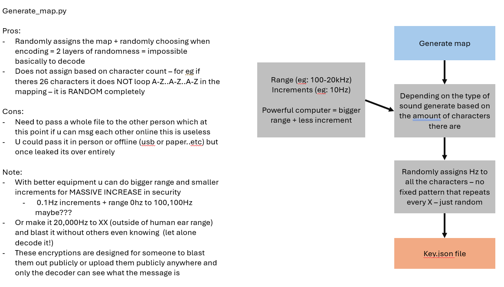
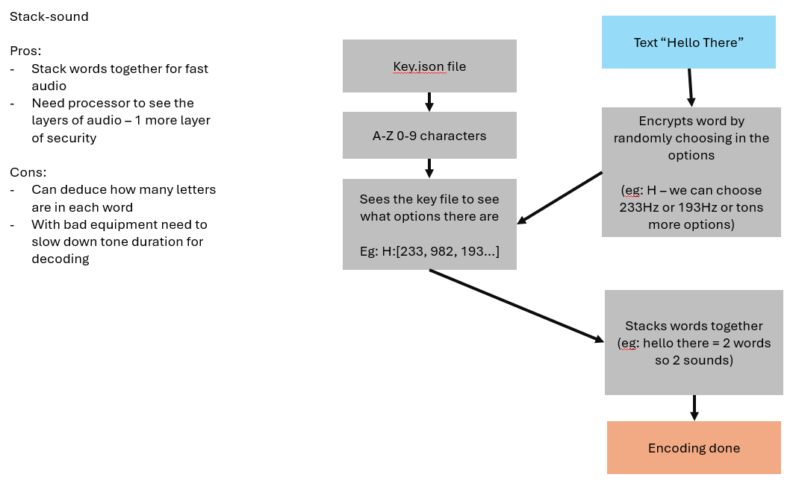
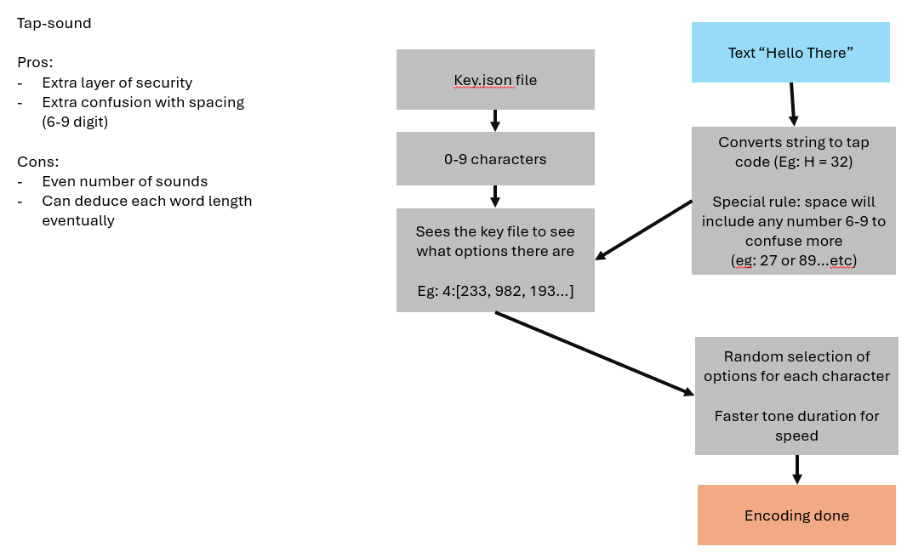
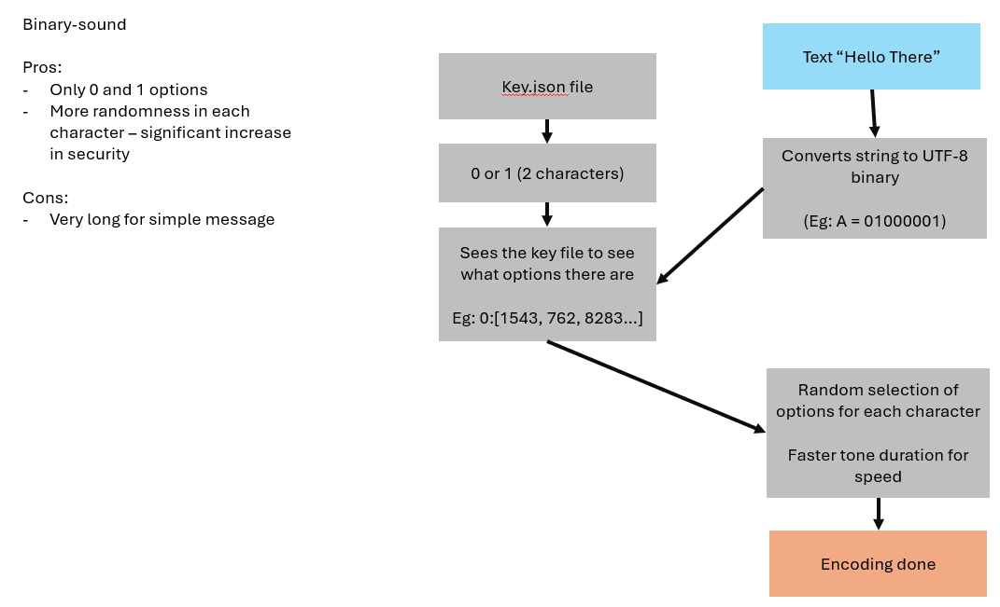
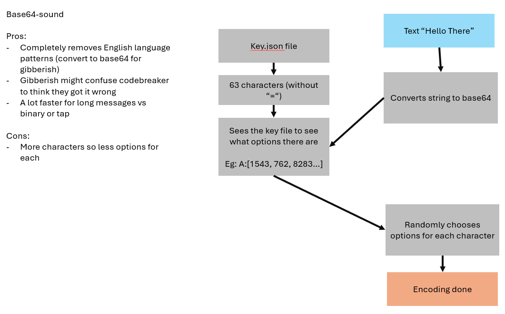

# Cool Encryption - Sound-Based Message Encoder

**What is this?**

This project lets you encode messages into sound. Three different encryption systems are available:
- **stack-sound**: character-based system (A-Z, 0-9) with words stacked sounds
- **tap-sound**: Text converted to tap code digits for more complicated sounds
- **binary-sound**: Binary-only system (0 and 1) for maximum randomness and security
- **base64-sound**: base64 encoding to prevent english language pattern recognition


As far as I know, it's nearly impossible to decode without the key file and a known text. You could blast this audio out anywhere you want and only the person you share the key with can decode it. At least I think so - it's pretty secure with the random frequency maps and multiple frequencies per symbol!

How the key.json works:


---

**Play around with frequency range, increment and tone duration to find the limit of your equipment to increase security!!**

---

Base64-sound is my favourite so far because it follows stack-sound and tap/binary-sound for a mixture of speed and security. I thought its genius because stack-sound can be cracked maybe by english language patterns and conversation - but base64 turns it into random gibberish.

---

## Comparison Table

| Feature | stack-sound | tap-sound | binary-sound | base64-sound |
|---------|-------------|----------|---------------|---------------|
| Encoding | Character-based | Tap code + digits | Binary (UTF-8) | Base64 (text) |
| Symbols | 36 (A-Z, 0-9) | 9 (digits 1-9) | 2 (0 and 1) | 63 (no =) |
| Freq Pool per Symbol | ≈550 | ≈2,200 | ≈9,950 | ≈300 |
| Message Format | Words grouped | digits | 0 or 1 | base64 chars |
| Tone Duration FASTEST | 0.1s | 0.02s | 0.02s | 0.01s (BEST) |
| Audio Size | Small | Large | Largest | Small |
| Security | Good | Great | Best | Best |
| Speed | Fast | Slow | Very Slow | Fast |

---

## Security Probability Comparison

| Metric | SHA-256 | stack-sound | tap-sound | binary-sound | base64-sound |
|--------|---------|-------------|----------|---------------|---------------|
| Combinations | **10^77.1** | **10^6,285** | **10^19,111** | **10^6,583** | **10^7,263** |

**Note:** These specs are with 100-20,000 Hz range and 10 or 5Hz increment and the message is 10 characters long. If the message is longer or better equipment is used (wider range + smaller increment), this can dramatically increase combinations and security.

---

### stack-sound - Character-Based System



The stack system that encodes characters directly.

**How it works:**

1. Generates a random frequency map for each character (A-Z, 0-9) with a given range and increment (e.g., 100-20,000 Hz with 10 Hz steps)

```json
{
  "A": [110, 180, 140, ...],
  "B": [120, 290, 200, ...],
  ...
}
```

2. Converts the message into sound (each character has multiple frequency options to pick from)

3. Combines all frequencies for each word into one stacked sound - so "HELLO" creates a single sound containing H, E, L, L, O frequencies all at once

- Longer tone duration required for reliable detection (typically 0.1s or higher)

**Features:**
- Each character picks a random frequency from its pool on every encode
- Character "E" repeated multiple times won't sound identical (adds randomness)
- Better for preserving word structure in original format

**Limitations:**
- Longer audio files (each word = one chunk)
- Needs longer tone durations for accuracy
- Message decoding may mix up character order within words (order preserved between words)

---

### tap-sound - Tap Code System



The tap code system (like prison communication) with individual digit sounds and space support.

**How it works:**

1. Converts each character to tap code (2 digits where col=1-5, row=1-5):


   - A = (1,1), B = (2,1), H = (3,2), I = (4,2), J = (5,2), Z = (5,5)
   - C and K both = (3,1) [only C/K are merged]

2. Generates frequency map for digits 1-9 (1-5 for characters, 6-9 for space markers):

```json
{
  "1": [freq1, freq2, ...],
  "2": [freq1, freq2, ...],
  ...
  "6": [freq1, freq2, ...],  // Used in space codes
  "7": [freq1, freq2, ...],  // Used in space codes
  "8": [freq1, freq2, ...],  // Used in space codes
  "9": [freq1, freq2, ...]   // Used in space codes
}
```

3. Encodes each digit as an individual sound (NOT stacked):
   - "HELLO" → [3,2, 5,1, 1,3, 1,3, 4,3] → 10 separate tones
   - "HELLO WORLD" → includes space code (any pair with 6-9) → multiple tones

4. Space handling: Any digit pair where at least one digit is 6-9 is decoded as a space
   - Examples: (6,2), (3,7), (9,1), (8,8) all = space
   - random encoding + random selection of space codes = insane security!!


5. Short tone durations work fine (0.03s-0.08s, optimized detection with FFT zero-padding and local maxima finding)

**Features:**
- Spaces are preserved in messages
- Much shorter audio files (individual digit sounds)
- Works with very short tone durations
- Improved frequency detection using zero-padding and parabolic interpolation
- More efficient encoding/decoding

**Limitations:**
- Individual digits detected separately (no word grouping)
- even number of sounds possible route to crack (but space codes add huge randomness)

---

### binary-sound - Binary-Only System



The simplest system - only 0 and 1, but with massive randomness per digit.

**How it works:**

1. Converts each character to UTF-8 binary (8 bits per byte):
   - "A" = 01000001
   - "AB" = 0100000101000010 (16 bits)

2. Generates frequency map for only 2 symbols (0 and 1):
```json
{
  "0": [freq1, freq2, ...],
  "1": [freq1, freq2, ...]
}
```
Because only 2 symbols exist, each one gets a MASSIVE pool of frequencies (≈10,000 each from 100-20,000 Hz range)

3. Encodes each bit as individual sound (like tap-sound)
   - "A" → [0,1,0,0,0,0,0,1] → 8 separate tones
   - "HELLO" → 40 tones (5 chars × 8 bits)

4. Each 0 or 1 picks random frequency from its huge pool

**Features:**
- Each bit has 9,950+ frequency options (way more than tap/stack-sound)
- Super random - no patterns possible
- Shorter tone durations work fine (0.03s+)
- Very efficient encoding (all binary = compact)

**Limitations:**
- Longer audio for same message length (8 bits per char vs 2 digits for tap-sound)
- More sounds to transmit overall
- Random pool so large that frequency analysis is nearly impossible

---

### base64-sound - Base64 Character System



Encodes your message as base64, then turns each character into a unique sound.

**How it works:**

1. Converts your message to base64 (A-Z, a-z, 0-9, +, /, -)
2. Removes any '=' padding (not needed for decoding)
3. Generates a random frequency map for each base64 character
4. Each character gets its own sound ("hello" = 8 base64 chars = 8 sounds)
5. No stacking: every character is played out one after another

- Short tone durations work well (0.03s+)
- Decoding automatically adds back any missing '=' padding

**Features:**
- Works for any text (UTF-8)
- Each character picks a random frequency from its pool
- Harder to crack by following english language patterns (base64 looks more random)

**Limitations:**
- Slightly longer audio for same message (base64 expands text)

---

## Usage Instructions for all systems (stack-sound, tap-sound, binary-sound, base64-sound)

```bash
cd stack-sound or tap-sound or binary-sound or base64-sound

# 1. Generate a new frequency map
python generate_map.py

# 2. Edit TEST_MESSAGE in encode-msg.py

# 3. Encode the message
python encode-msg.py

# 4. Decode the message
python decode-msg.py
```

---

## Frequency Map Security

The `key.json` file is your encryption key. Without it, the audio file is just noise.

**Tips:**
- Keep your file secret
- Use different maps for different messages
- Maps are stored in JSON - each digit/character maps to a pool of frequencies

---

## Notes

**General Limitations:**
- Audio quality matters (compression or noise affects decoding)
- Frequency increment affects accuracy (smaller = more frequencies, better randomness but more data)
- Tone duration trade-off: shorter = faster but harder to detect; longer = slower but more reliable

**Future Improvements:**
- Password-based or math-based key generation instead of random maps
- Error correction codes for noisy channels
- Variable tone durations for adaptive encoding
- Support for more characters through extended tap code
