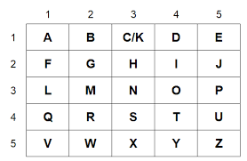

# Cool Encryption - Sound-Based Message Encoder

**What is this?**

This project lets you encode messages into sound. Two different encryption systems are available:
- **stack-sound**: Original character-based system (A-Z, 0-9)
- **tap-sound**: Tap code system with individual digit sounds

As far as I know, it's nearly impossible to decode without the json file key. See limitations below each sound system.

---

## Two Systems

### stack-sound - Character-Based System

The stack system that encodes characters directly.

**How it works:**

1. Generates a random frequency map for each character (A-Z, 0-9) with a given range and increment (e.g., 100-20,000 Hz with 10 Hz steps)

```json
{
  "A": [110, 180, 140, ...],
  "B": [120, 290, 200, ...],
  ...
}
```

2. Converts the message into sound (each character has multiple frequency options to pick from)

3. Combines all frequencies for each word into one stacked sound - so "HELLO" creates a single sound containing H, E, L, L, O frequencies all at once

- Longer tone duration required for reliable detection (typically 0.1s or higher)

**Features:**
- Each character picks a random frequency from its pool on every encode
- Character "E" repeated multiple times won't sound identical (adds randomness)
- Better for preserving word structure in original format

**Limitations:**
- Longer audio files (each word = one chunk)
- Needs longer tone durations for accuracy
- Message decoding may mix up character order within words (order preserved between words)

---

### tap-sound - Tap Code System

The tap code system (like prison communication) with individual digit sounds and space support.

**How it works:**

1. Converts each character to tap code (2 digits where col=1-5, row=1-5):



   - A = (1,1), B = (2,1), H = (3,2), I = (4,2), J = (5,2), Z = (5,5)
   - C and K both = (3,1) [only C/K are merged]

2. Generates frequency map for digits 1-9 (1-5 for characters, 6-9 for space markers):

```json
{
  "1": [freq1, freq2, ...],
  "2": [freq1, freq2, ...],
  ...
  "6": [freq1, freq2, ...],  // Used in space codes
  "7": [freq1, freq2, ...],  // Used in space codes
  "8": [freq1, freq2, ...],  // Used in space codes
  "9": [freq1, freq2, ...]   // Used in space codes
}
```

3. Encodes each digit as an individual sound (NOT stacked):
   - "HELLO" → [3,2, 5,1, 1,3, 1,3, 4,3] → 10 separate tones
   - "HELLO WORLD" → includes space code (any pair with 6-9) → multiple tones

4. Space handling: Any digit pair where at least one digit is 6-9 is decoded as a space
   - Examples: (6,2), (3,7), (9,1), (8,8) all = space
   - random encoding + random selection of space codes = insane security!!


5. Short tone durations work fine (0.03s-0.08s, optimized detection with FFT zero-padding and local maxima finding)

**Features:**
- Spaces are preserved in messages
- Much shorter audio files (individual digit sounds)
- Works with very short tone durations
- Improved frequency detection using zero-padding and parabolic interpolation
- More efficient encoding/decoding

**Limitations:**
- Individual digits detected separately (no word grouping)
- even number of sounds possible route to crack (but space codes add huge randomness)

---

## Usage Instructions for both stack-sound and tap-sound

```bash
cd stack-sound

# 1. Generate a new frequency map
python generate_map.py

# 2. Edit TEST_MESSAGE in encode-msg.py

# 3. Encode the message
python encode-msg.py

# 4. Decode the message
python decode-msg.py
```

---

## Frequency Map Security

The `frequency_map.json` file is your encryption key. Without it, the audio file is just noise.

**Tips:**
- Keep your frequency map file secret
- Use different maps for different messages
- Maps are stored in JSON - each digit/character maps to a pool of frequencies
- Example for stack-sound character "A" might have ~50 random frequencies spread across 100-20,000 Hz (1990 frequencies with 10 Hz increment)
- Example for tap-sound: digit "1" might have ~220 random frequencies spread across 100-20,000 Hz (1990 frequencies with 10 Hz increment)

---

## Technical Details

### stack-sound - Encoding Process
1. Message "HELLO" → split into words → ["HELLO"]
2. Each character picks random frequency from its pool
3. All frequencies for "HELLO" stacked together (mixed)
4. Output: 1 audio chunk (one sound file for the whole word)

### tap-sound - Encoding Process
1. Message "HELLO WORLD" → "HELLO WORLD"
2. Convert to tap code (with spaces):
   - H=(3,2), E=(5,1), L=(1,3), L=(1,3), O=(4,3)
   - Space = random pair with 6-9 (e.g., (6,8) or (4,7) or (9,9))
   - W=(2,5), O=(4,3), R=(2,4), L=(1,3), D=(4,1)
3. Flatten to digits: [3,2,5,1,1,3,1,3,4,3, X,Y, 2,5,4,3,2,4,1,3,4,1] where X,Y is space pair with at least one 6-9
4. Each digit picks random frequency from digit's pool
5. Output: Individual audio chunks (one tone per digit)

---

## Notes

**General Limitations:**
- Audio quality matters (compression or noise affects decoding)
- Frequency increment affects accuracy (smaller = more frequencies, better randomness but more data)
- Tone duration trade-off: shorter = faster but harder to detect; longer = slower but more reliable

**Future Improvements:**
- Password-based or math-based key generation instead of random maps
- Error correction codes for noisy channels
- Variable tone durations for adaptive encoding
- Support for more characters through extended tap code

---

## Comparison Table

| Feature | stack-sound | tap-sound |
|---------|-------------|----------|
| Encoding | Character-based | Tap code + digits |
| Message Format | Words grouped | Individual digits |
| Tone Duration | 0.1+s | 0.03+s |
| Audio Size | Smaller | Slightly larger (per char) |
| Speed | Slower | Faster |
| Efficiency | Good | Better |
| C/K Merging | No | Yes (only C/K) |